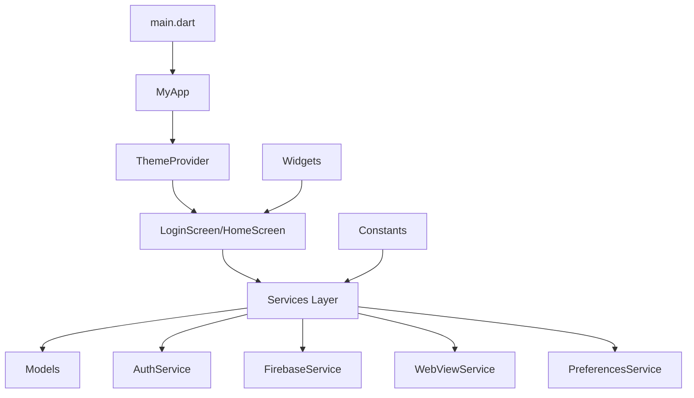
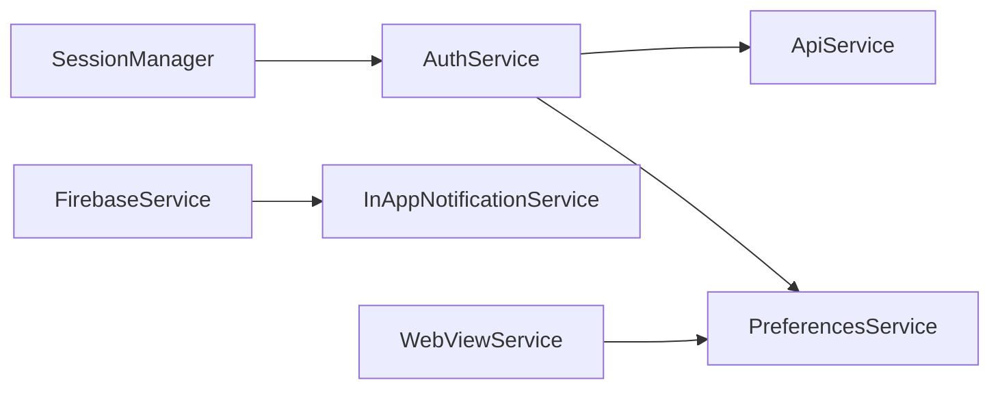
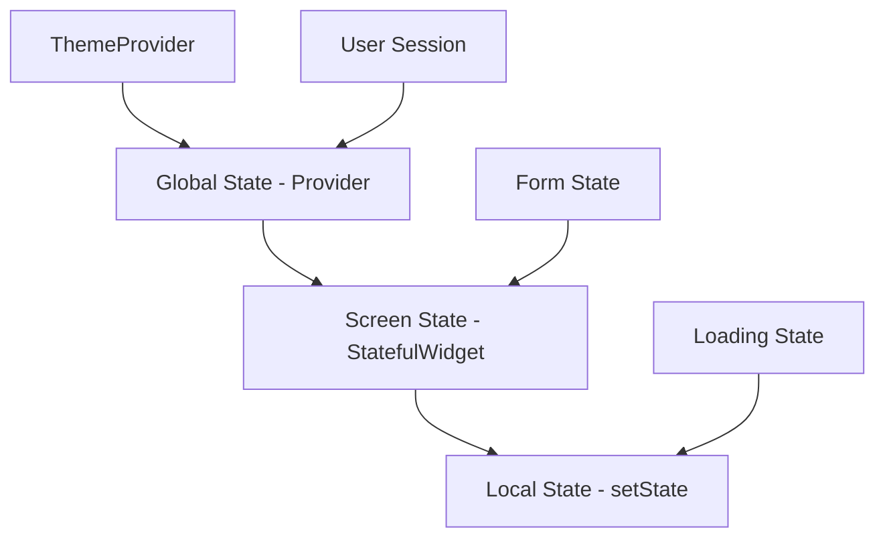

# 교보DTS 모바일 앱 상세 코드 분석

## 📋 목차
1. [프로젝트 개요](#프로젝트-개요)
2. [아키텍처 분석](#아키텍처-분석)
3. [Provider 패턴 적용 사례](#provider-패턴-적용-사례)
4. [소스코드 파일별 상세 분석](#소스코드-파일별-상세-분석)
5. [서비스 레이어 분석](#서비스-레이어-분석)
6. [모델 클래스 분석](#모델-클래스-분석)
7. [위젯 컴포넌트 분석](#위젯-컴포넌트-분석)
8. [상태 관리 패턴](#상태-관리-패턴)
9. [보안 및 성능 분석](#보안-및-성능-분석)

---

## 프로젝트 개요

### 기본 정보
- **프레임워크**: Flutter 3.35.6 / Dart 3.6.0
- **아키텍처**: Service-Widget 분리 구조
- **상태 관리**: Provider 패턴
- **주요 기능**: 웹뷰 통합, Firebase 푸시 알림, 자동 로그인

### 디렉토리 구조
```
lib/
├── constants/          # 앱 상수 및 설정
├── models/            # 데이터 모델
├── screens/           # 화면 위젯
├── services/          # 비즈니스 로직 서비스
├── themes/            # 테마 관련
├── utils/             # 유틸리티 함수
├── widgets/           # 재사용 가능한 위젯
└── main.dart          # 앱 진입점
```

---

## 아키텍처 분석

### 전체 아키텍처 패턴



### 계층별 책임 분리

1. **Presentation Layer** (Screens + Widgets)
   - UI 렌더링 및 사용자 상호작용 처리
   - 상태 관리 및 네비게이션

2. **Business Logic Layer** (Services)
   - 비즈니스 로직 처리
   - 외부 API 통신
   - 데이터 변환 및 검증

3. **Data Layer** (Models + Constants)
   - 데이터 구조 정의
   - 상수 및 설정 관리

---

## Provider 패턴 적용 사례

### 1. ThemeProvider 구현

```dart
class ThemeProvider extends ChangeNotifier {
  AppThemeType _currentTheme = AppThemeType.deepBlue;
  
  AppThemeType get currentTheme => _currentTheme;
  ThemeData get themeData => AppTheme.getTheme(_currentTheme);
  bool get isDarkMode => themeData.brightness == Brightness.dark;

  void setTheme(AppThemeType theme) async {
    _currentTheme = theme;
    final prefs = await SharedPreferences.getInstance();
    await prefs.setInt('theme', theme.index);
    notifyListeners(); // 상태 변경 알림
  }
}
```

**특징:**
- `ChangeNotifier` 상속으로 상태 변경 감지
- `notifyListeners()`로 UI 업데이트 트리거
- SharedPreferences와 연동한 영속성 보장

### 2. Provider 등록 및 사용

```dart
// main.dart에서 Provider 등록
ChangeNotifierProvider(
  create: (context) => ThemeProvider(),
  child: Consumer<ThemeProvider>(
    builder: (context, themeProvider, child) {
      return MaterialApp(
        theme: themeProvider.themeData, // 테마 동적 적용
        // ...
      );
    },
  ),
)
```

**장점:**
- 전역 상태 관리
- 위젯 트리 전체에서 테마 상태 공유
- 메모리 효율적인 상태 업데이트

---

## 소스코드 파일별 상세 분석

### 📱 main.dart - 앱 진입점

```dart
// 핵심 구조
void main() async {
  WidgetsFlutterBinding.ensureInitialized();
  FlutterNativeSplash.preserve(widgetsBinding: widgetsBinding);
  
  // Firebase 플랫폼별 초기화
  if (Platform.isIOS) {
    await Firebase.initializeApp(options: FirebaseOptions(...));
  } else if (Platform.isAndroid) {
    await Firebase.initializeApp(options: FirebaseOptions(...));
  }
  
  await _handleInitialMessage(); // iOS 초기 메시지 처리
  FlutterNativeSplash.remove();
  runApp(const MyApp());
}
```

**주요 기능:**
- 플랫폼별 Firebase 초기화
- 스플래시 스크린 관리
- 초기 푸시 메시지 처리 (iOS 특화)
- Provider 패턴 설정

**아키텍처적 특징:**
- 전역 상태 관리를 위한 `_globalAppState` 사용
- 콜백 기반 푸시 메시지 처리
- Context 안전성을 위한 재시도 로직

### 🔐 services/auth_service.dart - 인증 서비스

```dart
class AuthService {
  static final AuthService _instance = AuthService._internal();
  factory AuthService() => _instance; // 싱글톤 패턴
  
  Future<bool> login(String id, String password, bool autoLogin) async {
    // test 계정 mock 처리
    if (id == 'test') {
      if (password == '1234') {
        _currentUser = User(id: 'test', name: '홍길동', email: 'test@kyobodts.com');
        if (autoLogin) await _saveLoginInfo(id, password);
        return true;
      }
      return false;
    }
    
    // 실제 API 로그인
    return await _loginWithAPI(id, password, autoLogin);
  }
}
```

**설계 패턴:**
- **싱글톤 패턴**: 앱 전체에서 단일 인증 상태 관리
- **Strategy 패턴**: test 계정과 실제 계정 분리 처리
- **Template Method**: 공통 로그인 플로우 정의

**보안 특징:**
- SharedPreferences를 통한 안전한 로컬 저장
- 쿠키 기반 세션 관리
- 자동 재로그인 메커니즘

### 🔥 services/firebase_service.dart - Firebase 통합

```dart
class FirebaseService {
  static final FirebaseService _instance = FirebaseService._internal();
  
  // 콜백 기반 메시지 처리
  Function(Map<String, dynamic>)? onMessageReceived;
  Function(Map<String, dynamic>)? onDynamicContentRequested;
  Function(Map<String, dynamic>)? onWebViewRequested;
  
  Future<void> initialize() async {
    if (_isInitialized) return; // 중복 초기화 방지
    
    _messaging = FirebaseMessaging.instance;
    await _setupLocalNotifications();
    await _requestPermissions();
    await _setupMessageHandlers();
    await _getToken();
  }
}
```

**아키텍처 패턴:**
- **Observer 패턴**: 콜백을 통한 메시지 처리
- **State 패턴**: 초기화 상태 관리
- **Factory 패턴**: 플랫폼별 설정 생성

**고급 기능:**
- 포그라운드/백그라운드 메시지 분리 처리
- APNS 토큰 대기 로직 (iOS)
- 동적 콘텐츠 처리 시스템

### 🌐 services/webview_service.dart - WebView 관리

```dart
class WebViewService {
  static void executeAutoLogin(InAppWebViewController controller, 
                              String systemType, LoginInfo loginInfo) {
    switch (systemType) {
      case AppConstants.GROUPWARE:
        controller.evaluateJavascript(
          source: "document.querySelector('#j_username').value = '${loginInfo.id}'"
        );
        controller.evaluateJavascript(
          source: "document.querySelector('#j_password').value = '${loginInfo.password}'"
        );
        controller.evaluateJavascript(source: "document.loginForm.submit()");
        break;
      // GPRO 시스템 처리...
    }
  }
}
```

**특징:**
- **Command 패턴**: JavaScript 명령 실행
- **Strategy 패턴**: 시스템별 로그인 전략
- 정적 메서드로 유틸리티 성격

### 💾 services/preferences_service.dart - 로컬 저장소

```dart
class PreferencesService {
  static final PreferencesService _instance = PreferencesService._internal();
  
  Future<LoginInfo> getLoginInfo(String systemType) async {
    final prefs = await _prefs;
    final loginData = prefs.getStringList(systemType) ?? AppConstants.DEFAULT_LOGIN_INFO;
    final autoLoginKey = systemType == AppConstants.GROUPWARE 
        ? AppConstants.AUTOLOGIN_GROUPWARE 
        : AppConstants.AUTOLOGIN_GPRO;
    final isAutoLogin = prefs.getBool(autoLoginKey) ?? false;
    
    return LoginInfo.fromStringList(loginData, isAutoLogin);
  }
}
```

**설계 특징:**
- **Repository 패턴**: 데이터 접근 추상화
- **Builder 패턴**: LoginInfo 객체 생성
- 시스템별 설정 분리 관리

---

## 서비스 레이어 분석

### 서비스 간 의존성 관계



### 각 서비스의 역할

| 서비스 | 주요 책임 | 디자인 패턴 |
|--------|-----------|-------------|
| AuthService | 사용자 인증, 세션 관리 | Singleton, Strategy |
| FirebaseService | 푸시 알림, FCM 관리 | Observer, State |
| WebViewService | 웹뷰 제어, 자동 로그인 | Command, Strategy |
| PreferencesService | 로컬 데이터 저장 | Repository, Singleton |
| SessionManager | 세션 상태 관리 | Singleton, Observer |

---

## 모델 클래스 분석

### 1. LoginInfo 모델

```dart
class LoginInfo {
  final String id;
  final String password;
  final bool isAutoLogin;

  // Immutable 객체 설계
  LoginInfo copyWith({String? id, String? password, bool? isAutoLogin}) {
    return LoginInfo(
      id: id ?? this.id,
      password: password ?? this.password,
      isAutoLogin: isAutoLogin ?? this.isAutoLogin,
    );
  }

  // 직렬화/역직렬화
  List<String> toStringList() => [id, password];
  static LoginInfo fromStringList(List<String> list, bool isAutoLogin) {
    return LoginInfo(
      id: list.isNotEmpty ? list[0] : 'emptyID',
      password: list.length > 1 ? list[1] : 'emptyPW',
      isAutoLogin: isAutoLogin,
    );
  }
}
```

**설계 원칙:**
- **Immutability**: 불변 객체로 안전성 보장
- **Builder 패턴**: copyWith 메서드
- **Factory 패턴**: fromStringList 생성자

### 2. PushMessage 모델

```dart
class PushMessage {
  final String title;
  final String body;
  final String? contentUrl;
  final String? contentType;
  final String? action;
  final Map<String, dynamic> data;

  bool get hasContent => contentUrl != null && contentUrl!.isNotEmpty;
  
  String get contentTypeEnum {
    switch (contentType?.toLowerCase()) {
      case 'pdf': return 'pdf';
      case 'asset': return 'asset';
      default: return 'html';
    }
  }
}
```

**특징:**
- **Value Object 패턴**: 데이터 중심 객체
- **Computed Properties**: hasContent, contentTypeEnum
- **Type Safety**: nullable 필드 적절한 처리

---

## 위젯 컴포넌트 분석

### 1. 화면 컴포넌트 (Screens)

#### LoginScreen
```dart
class _LoginScreenState extends State<LoginScreen> {
  final _formKey = GlobalKey<FormState>();
  final _idController = TextEditingController();
  final _passwordController = TextEditingController();
  bool _autoLogin = false;
  bool _isLoading = false;

  @override
  void initState() {
    super.initState();
    _checkAutoLogin(); // 자동 로그인 확인
  }
}
```

**상태 관리:**
- **Local State**: 폼 상태, 로딩 상태
- **Controller Pattern**: TextEditingController 사용
- **Lifecycle Management**: initState에서 초기화

#### HomeScreen
```dart
class _HomeScreenState extends State<HomeScreen> {
  InAppWebViewController? _webViewController;
  bool _isLoginPage = false;
  final Set<String> _autoLoginExecuted = {}; // 중복 실행 방지

  void _handleLoadStop(WebUri? url) async {
    final systemType = WebViewService.getSystemTypeFromUrl(sURL);
    final loginKey = '$systemType-$sURL';
    
    if (loginInfo.isAutoLogin && !_autoLoginExecuted.contains(loginKey)) {
      _autoLoginExecuted.add(loginKey);
      WebViewService.executeAutoLogin(_webViewController!, systemType, loginInfo);
    }
  }
}
```

**고급 패턴:**
- **Memoization**: Set을 이용한 중복 실행 방지
- **Strategy Pattern**: URL별 다른 처리 로직
- **Observer Pattern**: WebView 이벤트 처리

### 2. 재사용 위젯 (Widgets)

#### CustomFloatingActionButton
```dart
class CustomFloatingActionButton extends StatelessWidget {
  final InAppWebViewController? webViewController;
  final bool isLoginPage;

  void _handleButtonPress() {
    webViewController?.getUrl().then((url) async {
      final systemType = WebViewService.getSystemTypeFromUrl(url.toString());
      
      if (systemType != null) {
        final loginInfo = await preferencesService.getLoginInfo(systemType);
        if (loginInfo.isAutoLogin) {
          WebViewService.executeAutoLogin(webViewController!, systemType, loginInfo);
        }
      } else {
        _refreshWebView();
      }
    });
  }
}
```

**설계 특징:**
- **Composition over Inheritance**: StatelessWidget 상속
- **Dependency Injection**: 컨트롤러 주입
- **Conditional Rendering**: 상태별 다른 아이콘

#### ContentModal
```dart
class ContentModal extends StatefulWidget {
  final String contentUrl;
  final String title;
  final ContentType contentType;

  Widget _buildContent() {
    switch (widget.contentType) {
      case ContentType.html: return _buildWebView();
      case ContentType.pdf: return _buildPdfView();
      case ContentType.asset: return _buildAssetView();
    }
  }
}
```

**패턴 적용:**
- **Strategy Pattern**: 콘텐츠 타입별 렌더링
- **Template Method**: 공통 구조, 세부 구현 분리
- **Factory Pattern**: ContentModalHelper

---

## 상태 관리 패턴

### 1. Provider 패턴 구현

```dart
// 1. Provider 정의
class ThemeProvider extends ChangeNotifier {
  AppThemeType _currentTheme = AppThemeType.deepBlue;
  
  void setTheme(AppThemeType theme) async {
    _currentTheme = theme;
    await _saveThemeToPrefs(theme);
    notifyListeners(); // 상태 변경 알림
  }
}

// 2. Provider 등록
ChangeNotifierProvider(
  create: (context) => ThemeProvider(),
  child: MyApp(),
)

// 3. Provider 사용
Consumer<ThemeProvider>(
  builder: (context, themeProvider, child) {
    return MaterialApp(
      theme: themeProvider.themeData,
      // ...
    );
  },
)
```

### 2. 상태 관리 계층



### 3. 상태 동기화 패턴

```dart
// Firebase 서비스에서 전역 상태 업데이트
class FirebaseService {
  Function(Map<String, dynamic>)? onMessageReceived;
  
  void _handleForegroundMessage(RemoteMessage message) {
    // 콜백을 통한 상태 전파
    onMessageReceived?.call(message.data);
  }
}

// main.dart에서 콜백 등록
FirebaseService().onMessageReceived = (data) {
  // 전역 상태 업데이트
  InAppNotificationService.addNotification(...);
};
```

---

## 보안 및 성능 분석

### 보안 구현

#### 1. 데이터 보호
```dart
// SharedPreferences를 통한 안전한 로컬 저장
Future<void> _saveLoginInfo(String id, String password) async {
  final prefs = await SharedPreferences.getInstance();
  await prefs.setString('login_id', id);
  await prefs.setString('login_password', password);
}
```

#### 2. 네트워크 보안
```dart
// HTTPS 통신 강제
static const String LOGIN_API_URL = 'https://km.kyobodts.co.kr/j_spring_security_check';

// 허용된 URL 스킴 제한
static const List<String> ALLOWED_URL_SCHEMES = [
  "http", "https", "file", "chrome", "data", "javascript", "about"
];
```

#### 3. WebView 보안
```dart
// 안전한 WebView 설정
InAppWebViewSettings(
  javaScriptEnabled: true, // 필요한 경우만 활성화
  mixedContentMode: MixedContentMode.MIXED_CONTENT_ALWAYS_ALLOW,
  // 기타 보안 설정...
)
```

### 성능 최적화

#### 1. 지연 초기화
```dart
class FirebaseService {
  bool _isInitialized = false;
  bool _isInitializing = false;

  Future<void> initialize() async {
    if (_isInitialized) return; // 중복 초기화 방지
    if (_isInitializing) return; // 동시 초기화 방지
    
    _isInitializing = true;
    // 초기화 로직...
    _isInitialized = true;
  }
}
```

#### 2. 메모리 관리
```dart
class _LoginScreenState extends State<LoginScreen> {
  final _idController = TextEditingController();
  final _passwordController = TextEditingController();

  @override
  void dispose() {
    _idController.dispose(); // 메모리 누수 방지
    _passwordController.dispose();
    super.dispose();
  }
}
```

#### 3. 비동기 처리 최적화
```dart
// Context 안전성을 보장하는 비동기 처리
void _safeShowWebViewModal(Map<String, dynamic> data) async {
  for (int attempt = 0; attempt < 5; attempt++) {
    final context = _navigatorKey.currentContext;
    
    if (context != null && mounted) {
      // 모달 표시
      return;
    }
    
    await Future.delayed(Duration(milliseconds: 200 * (attempt + 1)));
  }
}
```

---

## 결론 및 권장사항

### 강점
1. **명확한 아키텍처**: Service-Widget 분리로 관심사 분리
2. **적절한 디자인 패턴**: Singleton, Observer, Strategy 패턴 활용
3. **상태 관리**: Provider 패턴으로 효율적인 상태 관리
4. **에러 처리**: 포괄적인 try-catch 및 null 안전성
5. **플랫폼 최적화**: iOS/Android 각각 최적화된 처리

### 개선 권장사항
1. **보안 강화**: 하드코딩된 설정값을 환경변수로 이동
2. **테스트 코드**: 단위 테스트 및 통합 테스트 추가
3. **상태 관리 업그레이드**: Riverpod 또는 Bloc 패턴 고려
4. **코드 분리**: 복잡한 메서드를 더 작은 단위로 분리
5. **문서화**: 코드 주석 및 API 문서 보강

### 기술적 성숙도
- **아키텍처**: ⭐⭐⭐⭐⭐ (5/5)
- **코드 품질**: ⭐⭐⭐⭐☆ (4/5)
- **보안**: ⭐⭐⭐☆☆ (3/5)
- **성능**: ⭐⭐⭐⭐☆ (4/5)
- **유지보수성**: ⭐⭐⭐⭐☆ (4/5)

이 프로젝트는 Flutter 모바일 앱 개발의 모범 사례를 잘 보여주는 구조화된 코드베이스입니다.