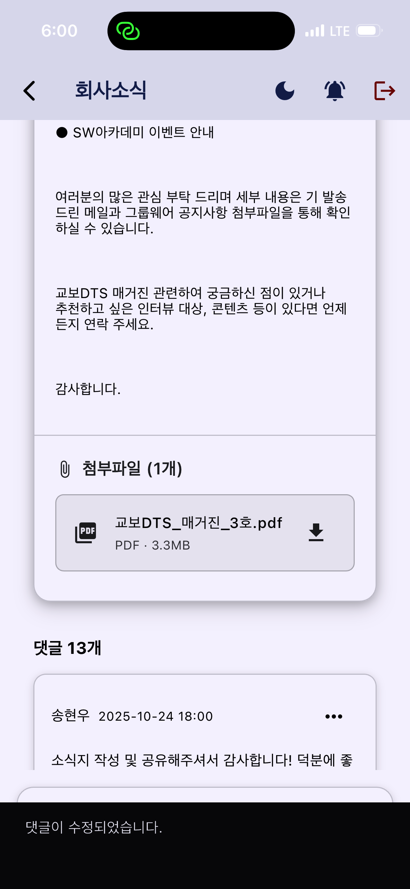
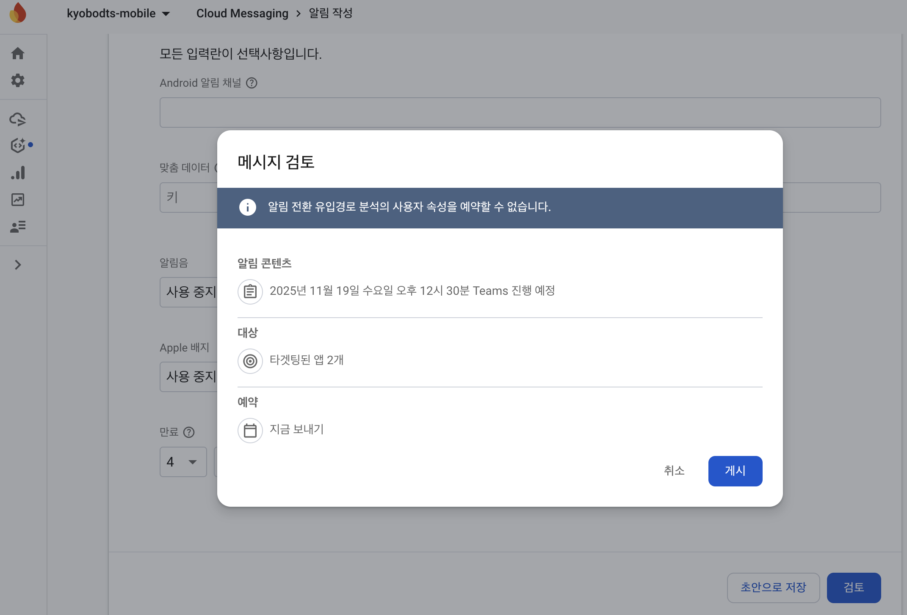

# 교보DTS 모바일 앱

> Flutter 기반 크로스플랫폼 모바일 앱으로 그룹웨어 및 인사시스템 통합 접근성 제공

## 📱 프로젝트 개요

### 목적
- 기존 웹 기반 그룹웨어를 모바일 친화적 UI/UX로 새롭게 제공하여 접근성 개선
- 자동 로그인 기능을 통한 사용자 편의성 향상
- Firebase 푸시 알림을 통한 실시간 알림 시스템 구축
- AI 요약 기능으로 한 주의 회사소식을 취합 및 요약하여 제공

### 핵심 기능
- **🔐 자동 로그인**: 디바이스 내 암호화된 로그인 정보 저장
- **🌐 AI 요약**: 핵심만 요약하여 중요한 회사 소식을 빠르게 제공
- **🔔 푸시 알림**: Firebase 기반 실시간 알림 및 콘텐츠 모달 표시
- **📱 크로스플랫폼**: Material 디자인을 차용하여 유려한 UI/UX로 Android/iOS 동시 지원

## 🏗️ 아키텍처

### 기술 스택
- **Framework**: Flutter 3.35.6 / Dart 3.6.0
- **WebView**: flutter_inappwebview 6.1.5
- **Push Notification**: Firebase Cloud Messaging
- **Local Storage**: SharedPreferences
- **UI Framework**: Material Design 3

### 프로젝트 구조
```
lib/
├── constants/          # 앱 상수 및 설정
├── models/            # 데이터 모델
├── screens/           # 화면 위젯
├── services/          # 비즈니스 로직 서비스
├── utils/             # 유틸리티 함수
├── widgets/           # 재사용 가능한 위젯
└── main.dart          # 앱 진입점
```

## 🚀 주요 기능 상세

### 1. 자동 로그인 시스템
- **암호화 저장**: SharedPreferences를 통한 로그인 정보 보안 저장
- **시스템별 관리**: GROUPWARE 시스템 개별 로그인 정보 관리
- **자동 실행**: 페이지 로드 시 자동 로그인
- **세션 관리**: 세션을 통해 그룹웨어 통신설정 관리

### 2. 웹뷰 통합
- **새창 지원**: flutter_inappwebview를 통한 팝업 창 처리
- **권한 관리**: 카메라, 마이크 등 웹 권한 자동 승인
- **URL 스킴 처리**: 외부 앱 연동 지원

### 3. Firebase 푸시 알림
- **실시간 알림**: 앱 상태와 무관한 푸시 메시지 수신
- **콘텐츠 모달**: HTML/PDF 콘텐츠 전체화면 표시
- **플랫폼별 최적화**: Android/iOS 각각 최적화된 알림 처리

### 4. 사용자 인터페이스
- **Material Design 3**: 최신 디자인 시스템 적용
- **반응형 레이아웃**: 다양한 화면 크기 지원
- **네이티브 스플래시**: flutter_native_splash를 통한 부드러운 앱 시작

## 5. AI 요약
- **AWS Bedrock** titan모델을 차용하여 고품질의 요약 성능 제공
- **정기 작업** 매일 오전 업무시간 10분 전에 회사의 소식을 정기적으로 요약하여 푸시메세지로 제공

## 🛠️ 개발 환경

### 필수 요구사항
- **Flutter SDK**: 3.35.6 이상
- **Dart SDK**: 3.6.0 이상
- **Android Studio**: Arctic Fox 이상
- **Xcode**: 13.0 이상 (iOS 개발 시)

### 플랫폼별 설정
#### Android
- **Min SDK**: 21 (Android 5.0)
- **Target SDK**: 34 (Android 14)
- **Gradle**: 8.10.2
- **Kotlin**: 1.9.25

#### iOS
- **Deployment Target**: 13.0
- **CocoaPods**: 1.16.2 이상

### 의존성 라이브러리
```yaml
dependencies:
  flutter_inappwebview: 6.1.5      # 고급 웹뷰 기능
  shared_preferences: 2.3.2        # 로컬 데이터 저장
  firebase_core: ^3.6.0            # Firebase 코어
  firebase_messaging: ^15.1.3      # 푸시 알림
  flutter_local_notifications: ^18.0.1  # 로컬 알림
  url_launcher: 6.3.1              # 외부 URL 실행
  path_provider: ^2.1.4            # 파일 시스템 접근
```

## 📋 설치 및 실행

### 1. 프로젝트 클론
```bash
git clone <repository-url>
cd kyobodts_mobile
```

### 2. 의존성 설치
```bash
flutter pub get
```

### 3. Firebase 설정
- Android: `android/app/google-services.json` 파일 배치
- iOS: `ios/Runner/GoogleService-Info.plist` 파일 배치

### 4. 빌드 및 실행
```bash
# 개발 모드 실행
flutter run

# 릴리즈 빌드
flutter build apk --release  # Android
flutter build ios --release  # iOS
```

## 🔧 설정 및 커스터마이징

### 앱 아이콘 및 스플래시 변경
```bash
# 아이콘 생성
flutter pub run flutter_launcher_icons

# 스플래시 스크린 생성
flutter pub run flutter_native_splash:create
```

### Firebase 프로젝트 연결
1. Firebase Console에서 새 프로젝트 생성
2. Android/iOS 앱 등록
3. 설정 파일 다운로드 및 배치
4. 푸시 알림 테스트
5. AI 요약 테스트

## 🧪 테스트

### 디버그 기능
- **FCM 토큰 확인**: 플로팅 버튼을 통한 토큰 표시
- **푸시 알림 테스트**: 샘플 콘텐츠 모달 테스트
- **자동 로그인 테스트**: 개발자 도구를 통한 로그인 플로우 확인

### 테스트 환경
- **Android**: 에뮬레이터 및 실제 디바이스 모두 지원
- **iOS**: 실제 디바이스 권장 (푸시 알림 완전 테스트)

## 🔒 보안 고려사항

### 데이터 보호
- **로그인 정보**: SharedPreferences를 통한 디바이스 내 암호화 저장
- **Firebase 설정**: 클라이언트 측 공개 설정값 (보안 위험 없음)
- **HTTPS 통신**: 모든 네트워크 통신 암호화

### 권한 관리
- **최소 권한 원칙**: 필요한 권한만 요청
- **투명한 권한 사용**: 사용자에게 권한 사용 목적 명시

## 📈 성능 최적화

### 메모리 관리
- **웹뷰 최적화**: 불필요한 웹뷰 인스턴스 정리
- **이미지 캐싱**: 효율적인 리소스 관리
- **백그라운드 처리**: Firebase 백그라운드 메시지 최적화

### 배터리 효율성
- **푸시 알림 최적화**: 필요한 경우에만 알림 표시
- **백그라운드 작업 최소화**: 불필요한 백그라운드 프로세스 제거

## 🐛 알려진 이슈 및 해결방법

### iOS 관련
- **APNS 토큰 이슈**: 시뮬레이터에서는 푸시 알림 테스트 불가 → 실제 디바이스 사용 필요
- **HTTP 통신 차단**: NSAppTransportSecurity 설정으로 해결

### Android 관련
- **새창 처리**: flutter_inappwebview를 통한 팝업 창 지원
- **권한 요청**: 런타임 권한 자동 처리

## 🔄 업데이트 및 유지보수

### 정기 업데이트 항목
- **Flutter SDK**: 분기별 최신 버전 업데이트
- **의존성 라이브러리**: 보안 패치 및 기능 개선 반영
- **Firebase 설정**: 프로젝트 설정 및 보안 규칙 검토

### 모니터링
- **Firebase Analytics**: 사용자 행동 분석
- **Crashlytics**: 앱 안정성 모니터링
- **Performance Monitoring**: 성능 지표 추적

## 예시화면








